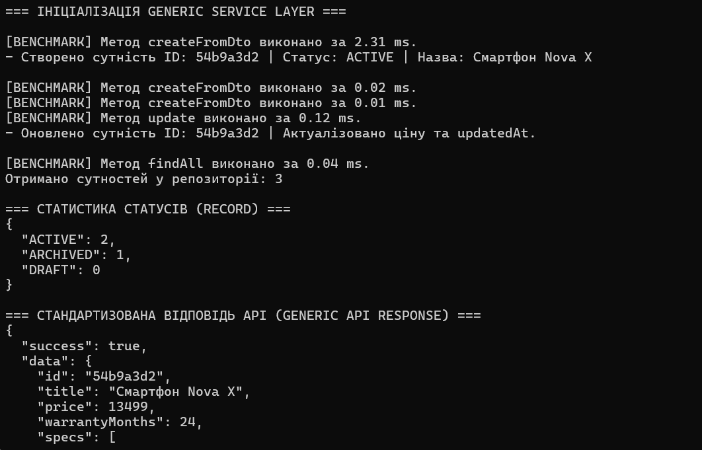
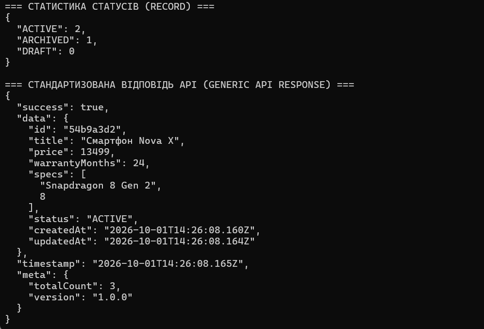

# webdev-pr3-typescript-generics
Практична робота №3 — **«Узагальнення, декоратори та утиліти типів TypeScript»**.

Варіант 1 — Електроніка та гаджети.

**Виконала:** Бецанич Тетяни

## Мета роботи

- Опанувати generics, утилітарні типи (utility types) та декоратори TypeScript.
- Реалізувати патерн Generic Repository та універсальну обгортку `ApiResponse<T>`.
- Створювати DTO за допомогою `Partial`, `Required`, `Pick`, `Omit`, `Record`.
- Написати власні декоратори класів і методів, організувати модулі через barrel files.

## Структура проєкту

```
src/
├── decorators/
│   ├── frozen-entity.decorator.ts
│   ├── log-execution-time.decorator.ts
│   └── index.ts
├── repositories/
│   ├── repository.interface.ts
│   ├── in-memory.repository.ts
│   ├── gadget.repository.ts
│   └── index.ts
├── types/
│   ├── base.types.ts
│   ├── dto.types.ts
│   ├── entity-status.enum.ts
│   ├── gadget.entity.ts
│   └── index.ts
└── index.ts
```

## Що реалізовано

- **Generics:** `BaseEntity`, `ApiResponse<TData>`, `IRepository<T extends BaseEntity>`.
- **InMemoryRepository<T>:** зберігання в `Map<string, T>`, CRUD-операції.
- **GadgetRepository:** репозиторій для сутності «гаджет».
- **DTO та утиліти типів:** створення й оновлення сутностей без ручного дублювання полів.
- **Декоратори:** `@LogExecutionTime` (вимірювання часу виконання методу) та `@FrozenEntity` (заморожування сутності).

## Вимоги

- Node.js 18+ (LTS)
- npm

## Запуск

```bash
npm install
npm start
```
## Результат виконання



